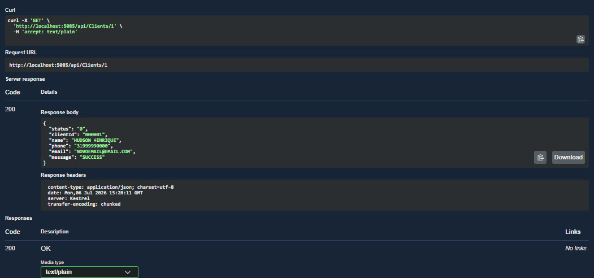
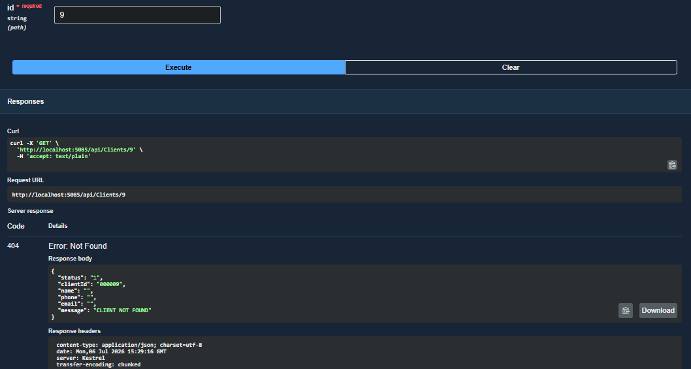
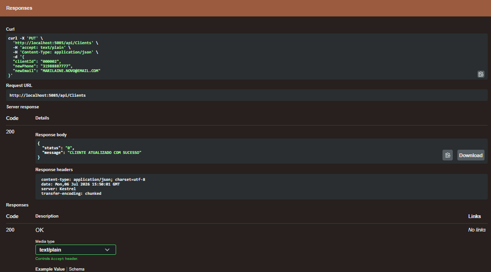
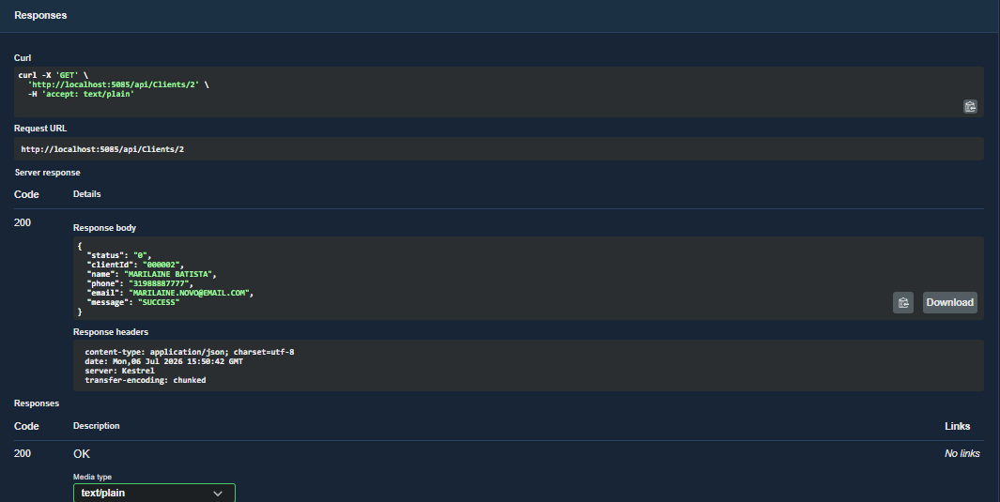

# Plano de Testes: Modernização - Cooperativa Financeira Alfa

## 1. Objetivo

Este documento apresenta os testes realizados para verificar se a solução desenvolvida atende às necessidades da Cooperativa Financeira Alfa.

O principal objetivo foi garantir que os atendentes consigam consultar e atualizar as informações de contato dos clientes de forma segura, mantendo a integração com o sistema legado em COBOL e preservando o funcionamento já existente.

Além de validar o comportamento esperado da aplicação, os testes também tiveram como objetivo assegurar que as informações continuem sendo processadas corretamente pelo sistema legado, sem impactar a estabilidade das operações da cooperativa.

---

## 2. Casos de Teste (Funcionais)

### CT01: Consultar cliente existente com sucesso

**Descrição:**  
Verificar se o sistema consegue localizar um cliente já cadastrado e exibir suas informações corretamente.

**Pré-condições:**

- A API deve estar em execução;
- O sistema legado em COBOL deve estar disponível e acessível.

**Passos de Execução:**

1. Abrir a ferramenta de testes da API (Swagger).
2. Informar o código de um cliente existente.
3. Enviar uma requisição `GET` para a rota:

```http
/clients/{id}
```

**Resultado Esperado:**

O sistema deve informar que a consulta foi realizada com sucesso e apresentar os seguintes dados do cliente:

- Código;
- Nome;
- Telefone;
- E-mail.

**Status da Execução:**  
✅ APROVADO

**Evidência:**  


---

### CT02: Consultar cliente inexistente

**Descrição:**  
Verificar o comportamento da aplicação quando é informado um código de cliente que não existe na base de dados.

**Pré-condições:**

- A API deve estar em execução.

**Passos de Execução:**

1. Abrir o Swagger.
2. Informar um código de cliente inexistente.
3. Enviar uma requisição `GET` para a rota:

```http
/clients/{id}
```

**Resultado Esperado:**

O sistema deve informar de maneira clara que o cliente não foi encontrado, sem apresentar mensagens técnicas ou expor detalhes internos do sistema.

**Status da Execução:**  
✅ APROVADO

**Evidência:**  


---

### CT03: Atualizar dados de contato com sucesso

**Descrição:**  
Verificar se é possível alterar as informações de contato de um cliente e confirmar que essas alterações foram realmente gravadas pelo sistema.

**Pré-condições:**

- O cliente deve existir na base de dados;
- A API e o sistema legado devem estar em execução.

**Passos de Execução:**

1. Enviar uma requisição `PUT` para a rota:

```http
/clients
```

2. Informar o código do cliente, o novo telefone e o novo e-mail.
3. Após a atualização, realizar uma nova consulta utilizando o mesmo cliente para confirmar que os dados foram alterados.

**Resultado Esperado:**

O sistema deve confirmar que a atualização foi realizada com sucesso e, na nova consulta, apresentar os dados de contato atualizados.

**Status da Execução:**  
✅ APROVADO

**Evidência 1 (Atualização realizada com sucesso):**  


**Evidência 2 (Consulta com dados atualizados):**  


---

## 3. Considerações sobre os Testes Automatizados

Além dos testes realizados manualmente, o projeto também possui um conjunto de testes automatizados integrado ao processo de desenvolvimento.

Sempre que uma alteração é realizada no código, esses testes ajudam a verificar se funcionalidades que já estavam funcionando continuam operando corretamente.

Essa abordagem traz mais segurança para o projeto, reduz o risco de que novas modificações introduzam erros e aumenta a confiança na evolução da aplicação ao longo do tempo.

Em outras palavras, os testes automatizados funcionam como uma camada adicional de proteção, garantindo que a modernização do sistema permaneça estável e confiável mesmo após futuras manutenções e melhorias.

---

## 4. Conclusão

Os testes realizados demonstraram que a solução atende aos requisitos propostos para o projeto.

As funcionalidades de consulta e atualização de dados estão operando corretamente, mantendo a comunicação com o sistema legado e oferecendo uma experiência simples e segura para os usuários da Cooperativa Financeira Alfa.

A realização dos testes, tanto manuais quanto automatizados, contribuiu para garantir a qualidade da solução e aumentar a confiança de que futuras evoluções poderão ser implementadas de maneira segura e controlada.